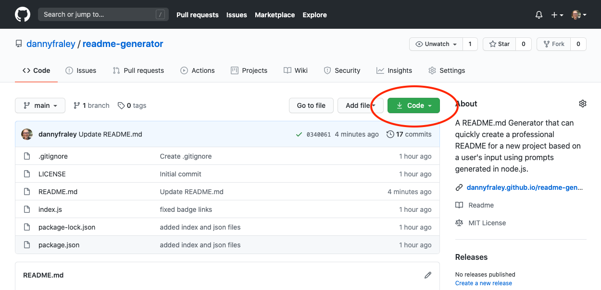
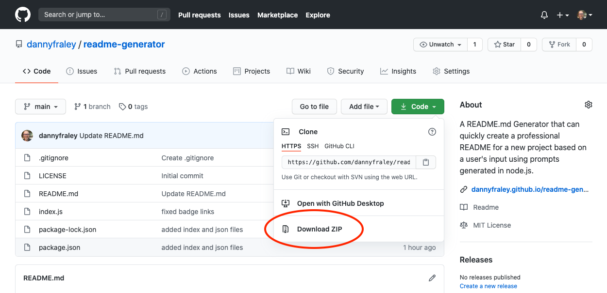
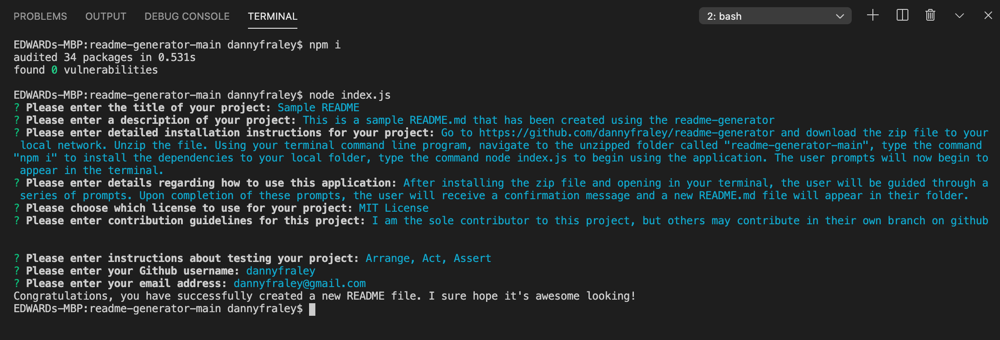

# README Generator

## Description
A `README.md` Generator that can quickly create a professional README for a new project based on a user's input using prompts generated in node.js.

## Table of Contents 

* [Installation](#installation)

* [Usage](#usage)

* [License](#license)

* [Contributing](#contributing)

* [Tests](#tests)

* [Questions](#questions)

## Installation
1. Go to https://github.com/dannyfraley/readme-generator and download the zip file to your local network.
2. Unzip the file.
3. Using your terminal command line program, navigate to the unzipped folder called `"readme-generator-main"`.
4. Type the command `npm i` to install the dependencies to your local folder.
5. Type the command `node index.js` to begin using the application. The user prompts will now begin to appear in the terminal.

## Usage
After installing the zip file and opening in your terminal, the user will be guided through a series of prompts, asking the user to enter the following information --

**Please enter the title of your project:**

**Please enter a description of your project:**

**Please enter detailed installation instructions for your project:**

**Please enter details regarding how to use this application:**

**Please choose which license to use for your project:**
* Apache License 2.0
* BSD 3-Clause License
* BSD 2-Clause License
* GNU General Public License v3.0
* GNU Library (LGPL)
* MIT License
* Mozilla Public License 2.0
* Common Development and Distribution License
* Eclipse Public License
* Creative Commons License

**Please enter contribution guidelines for this project:**

**Please enter instructions about testing your project:**

**Please enter your Github username:**

**Please enter your email address:**

Upon completion of these prompts, the user will receive confirmation of a successful README file creation with the message *"Congratulations, you have successfully created a new README file. I sure hope it's awesome looking!"*

A new `README.md` file will then appear in their folder, containing all of the information the user has just entered.

**Click the image below to watch a video of the README Generator in action!**

## License
MIT License

Copyright (c) 2020 Danny Fraley

Permission is hereby granted, free of charge, to any person obtaining a copy
of this software and associated documentation files (the "Software"), to deal
in the Software without restriction, including without limitation the rights
to use, copy, modify, merge, publish, distribute, sublicense, and/or sell
copies of the Software, and to permit persons to whom the Software is
furnished to do so, subject to the following conditions:

The above copyright notice and this permission notice shall be included in all
copies or substantial portions of the Software.

THE SOFTWARE IS PROVIDED "AS IS", WITHOUT WARRANTY OF ANY KIND, EXPRESS OR
IMPLIED, INCLUDING BUT NOT LIMITED TO THE WARRANTIES OF MERCHANTABILITY,
FITNESS FOR A PARTICULAR PURPOSE AND NONINFRINGEMENT. IN NO EVENT SHALL THE
AUTHORS OR COPYRIGHT HOLDERS BE LIABLE FOR ANY CLAIM, DAMAGES OR OTHER
LIABILITY, WHETHER IN AN ACTION OF CONTRACT, TORT OR OTHERWISE, ARISING FROM,
OUT OF OR IN CONNECTION WITH THE SOFTWARE OR THE USE OR OTHER DEALINGS IN THE
SOFTWARE.

## Contributing
Danny Fraley is currently the sole contributor to this project. If you are interested in contributing, feel free to do so in another branch.

## Testing
Testing performed in VS Code, manually by Danny Fraley.

## Questions
For question about using this application, please contact me at one of the links below.

Email: dannyfraley@gmail.com 

My GitHub Profile: https://github.com/dannyfraley
